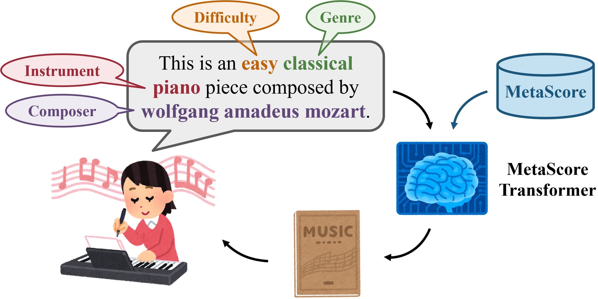
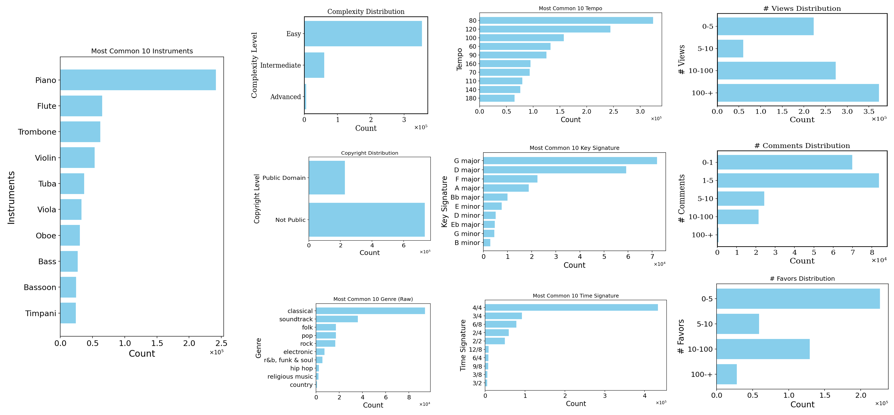

# Generating Symbolic Music from Natural Language Prompts using an LLM-Enhanced Dataset 

Weihan Xu, Julian McAuley, Taylor Berg-Kirkpatrick, Shlomo Dubnov, Hao-Wen Dong

*The 26th conference of the International Society for Music Information Retrieval (ISMIR 2025)*

Pretrained Model: [Download (Google Drive)](https://drive.google.com/file/d/1Mtfxt9BYO1H-b8K0qlDQDThJD0gsy_3F/view?usp=drive_link)

Paper: [arXiv PDF](https://arxiv.org/pdf/2410.02084)  

Code: [GitHub – MetaScore_Official (codebase branch)](https://github.com/wx83/MetaScore_Official/tree/codebase)

Demo Page: [Demo Page](https://wx83.github.io/MetaScore_Official/)

---

## Contents:

1. Overview

2. MetaScore Distribution 

### Overview

Leveraging the LLM-enhanced MetaScore dataset, our proposed MetaScore Transformer (MST) model generates symbolic music using natural language prompts with difficulty, genre, instrument and composer controls. The symbolic music outputs allow the user to further edit and complete the composition.

---

### Dataset Distribution

We collect 963K songs paired with musical scores and metadata from the MuseScore forum.

1. MetaScore-Raw (963K): The raw MuseScore files and metadata scraped from the MuseScore forum as well as the corresponding musicxml file for future research.
2. Metascore-Genre (181K): A subset of MuseScore-Raw containing files with user-annotated genres. Additionally, we discard any songs composed by a composer that has less than 100 compositions in MetaScore-Raw. We also provide LLM-generated captions based on information extracted from the metadata in Metascore-Genre. 
3. MetaScore-Plus (963K): MetaScore-Raw where missing genre tags are completed by the trained genre tagger.We also provide LLM-generated captions based on information extracted from the metadata in MetaScore-Plus. 

*Due to copyright concerns, we will publicly release music scores and metadata that are in the public domain (228K) or licensed with a Creative Commons licenses (46K) from MetaScore-Plus. The rest of the dataset will be provided upon request for research purpose.*

---

## Contacts
Weihan Xu: weihan.xu@duke.edu